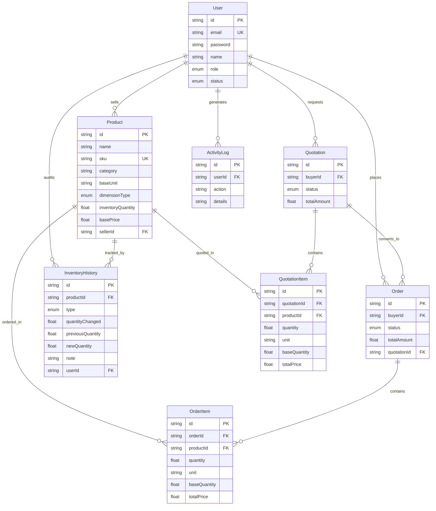

# Assam EdChem — B2B Inventory, Quotation & Order Management Platform

> A full-stack enterprise-grade B2B platform built with **Next.js 16**, **Prisma ORM**, **PostgreSQL (Neon)**, and **Vanilla CSS**. Manages the complete procurement lifecycle — from product cataloging and inventory tracking to multi-item quotation negotiations and order fulfillment — with robust Role-Based Access Control (RBAC) for **Admin**, **Seller**, and **Buyer** roles.

---

## Table of Contents

1. [Architecture Overview](#architecture-overview)
2. [Tech Stack](#tech-stack)
3. [Folder Structure](#folder-structure)
4. [Database Schema (ER Diagram)](#database-schema-er-diagram)
5. [Feature Modules](#feature-modules)
6. [Unit Conversion System](#unit-conversion-system)
7. [Pricing Engine](#pricing-engine)
8. [API Documentation](#api-documentation)
9. [Security Implementation](#security-implementation)
10. [Setup & Deployment Guide](#setup--deployment-guide)
11. [Testing Guide](#testing-guide)
12. [Interview Preparation Notes](#interview-preparation-notes)

---

## Architecture Overview

```
┌─────────────────────────────────────────────────┐
│                   CLIENT (Browser)               │
│  Landing Page │ Login/Register │ Role Dashboards  │
└──────────────────────┬──────────────────────────┘
                       │ HTTPS
┌──────────────────────▼──────────────────────────┐
│              NEXT.JS APP ROUTER                  │
│  ┌───────────────┐  ┌────────────────────────┐  │
│  │  Middleware    │  │     API Routes         │  │
│  │  (RBAC/JWT)   │──│  /api/auth/*           │  │
│  └───────────────┘  │  /api/products/*       │  │
│                     │  /api/orders/*          │  │
│                     │  /api/quotations/*      │  │
│                     │  /api/users/*           │  │
│                     │  /api/reports           │  │
│                     │  /api/inventory/history │  │
│                     └────────────┬───────────┘  │
└──────────────────────────────────┼───────────────┘
                                   │ Prisma ORM
┌──────────────────────────────────▼───────────────┐
│            NEON POSTGRESQL DATABASE               │
│  Users │ Products │ Orders │ Quotations │ Logs   │
└──────────────────────────────────────────────────┘
```

---

## Tech Stack

| Layer          | Technology                           |
| -------------- | ------------------------------------ |
| Framework      | Next.js 16 (App Router, Turbopack)   |
| Language       | JavaScript (ES Modules)              |
| Database       | PostgreSQL via Neon                   |
| ORM            | Prisma 6                             |
| Authentication | Custom JWT (Web Crypto API) + bcryptjs|
| Validation     | Zod                                  |
| Icons          | Lucide React                         |
| Styling        | Vanilla CSS (CSS Variables, HSL)      |
| Deployment     | Vercel                               |

---

## Folder Structure

```
assamedchem/
├── prisma/
│   └── schema.prisma           # Database schema (8 models, 5 enums)
├── src/
│   ├── app/
│   │   ├── layout.js           # Root layout (ToastProvider wrapper)
│   │   ├── page.js             # Landing page with auto-redirect
│   │   ├── globals.css         # Design system (themes, components)
│   │   ├── login/page.js       # Login form with remember-me
│   │   ├── register/page.js    # Registration with role selector
│   │   ├── unauthorized/page.js# 403 Access Denied view
│   │   ├── admin/page.js       # Admin dashboard (7 tabs)
│   │   ├── seller/page.js      # Seller dashboard (5 tabs)
│   │   ├── buyer/page.js       # Buyer dashboard (4 tabs)
│   │   └── api/
│   │       ├── auth/
│   │       │   ├── register/route.js
│   │       │   ├── login/route.js
│   │       │   ├── logout/route.js
│   │       │   └── me/route.js
│   │       ├── products/
│   │       │   ├── route.js        # GET (list) + POST (create)
│   │       │   └── [id]/route.js   # PUT (update) + DELETE
│   │       ├── orders/
│   │       │   ├── route.js        # GET (list) + POST (create)
│   │       │   └── [id]/route.js   # PUT (status update)
│   │       ├── quotations/
│   │       │   ├── route.js        # GET (list) + POST (create)
│   │       │   └── [id]/route.js   # PUT (approve/reject/convert)
│   │       ├── users/
│   │       │   ├── route.js        # GET (admin list)
│   │       │   └── [id]/route.js   # PUT (toggle) + DELETE
│   │       ├── reports/route.js    # GET (analytics)
│   │       └── inventory/
│   │           └── history/route.js# GET (audit logs)
│   ├── components/
│   │   ├── Toast.js            # Toast notification context
│   │   ├── Sidebar.js          # Role-specific sidebar navigation
│   │   └── Navbar.js           # Top navbar with theme toggle
│   ├── lib/
│   │   ├── db.js               # Prisma client singleton
│   │   ├── auth.js             # JWT sign/verify + bcrypt
│   │   └── unitConversion.js   # Weight/Volume/Count conversions
│   └── middleware.js           # RBAC route protection
├── .env.example                # Environment variable template
├── package.json
└── test-conversions.js         # Unit conversion verification script
```

---

## Database Schema (ER Diagram)



---

## Feature Modules

### Authentication Module (`/api/auth/*`)
- **Registration**: Zod-validated input → bcrypt password hashing (10 salt rounds) → DB insert → Activity log.
- **Login**: Email lookup → status check (INACTIVE blocks login) → bcrypt comparison → JWT signing via Web Crypto HMAC-SHA256 → httpOnly cookie set with configurable TTL (24h default, 30 days with "remember me").
- **Logout**: Cookie deletion + Activity log.
- **Session Check (`/me`)**: Decodes JWT from cookie, cross-references DB for live status verification.

### Middleware RBAC (`src/middleware.js`)
- Intercepts all requests matching `/admin/*`, `/seller/*`, `/buyer/*`, and `/api/*`.
- Verifies JWT from `session_token` cookie using Edge-compatible Web Crypto API.
- Redirects unauthenticated users to `/login`.
- Blocks cross-role access (e.g., BUYER accessing `/admin` → `/unauthorized`).
- Returns 401/403 JSON for unauthorized API calls.
- Detects deactivated accounts and force-logs them out.

### Admin Dashboard (`/admin`)
| Tab | Features |
|-----|----------|
| Dashboard | KPI cards (users, products, orders, revenue), recent activity feed, order pipeline bar chart |
| User Management | Search/filter by role/status, activate/deactivate toggle, delete users |
| Product & SKU | Full CRUD, search/filter/sort, modal forms for create/edit |
| Inventory Audit | Live stock levels table, Add/Reduce stock modal with unit conversion, audit history sidebar |
| Quotations | View all platform quotes, approve/reject/convert actions |
| Orders Log | Full order pipeline with inline status dropdown selector |
| Reports & Analytics | Category distribution bars, conversion rate donut, top products table |

### Seller Dashboard (`/seller`)
| Tab | Features |
|-----|----------|
| Dashboard | Own KPI cards, low-stock warning system with restock buttons, quick actions |
| Manage Products | Own product CRUD with search/filter/sort |
| Pricing & Stock | Stock level table, adjustment modal with unit selector, audit log sidebar |
| Review Quotes | Received quotations filtered to own products, approve/reject buttons |
| Dispatch Orders | Incoming orders with inline status pipeline selector |

### Buyer Dashboard (`/buyer`)
| Tab | Features |
|-----|----------|
| Dashboard | Active quotes count, in-transit orders, total procurement value, recent purchases |
| Browse Catalog | Product grid with search/filter/sort, "Add to RFQ" buttons, category/dimension/price filters |
| RFQ/Order Builder | Sticky basket sidebar, quantity+unit selectors, live price calculations, submit as Quote or Direct Order |
| My Quotations | History table, "Checkout to Order" for approved quotes |
| My Orders | History table with status badges, cancel button for pending orders |

---

## Unit Conversion System

### Supported Dimensions and Units

| Dimension | Base Unit | Supported Units | Conversion Factor |
|-----------|-----------|----------------|-------------------|
| WEIGHT    | g         | g, kg          | 1 kg = 1000 g     |
| VOLUME    | mL        | mL, L          | 1 L = 1000 mL     |
| COUNT     | item      | item           | 1 item = 1 item   |

### How It Works

1. **Product Registration**: Seller specifies `baseUnit` (e.g., `g`) and `basePrice` (e.g., ₹0.06/g).
2. **Buyer Request**: Buyer requests `2.5 kg` of sugar.
3. **Conversion**: System converts `2.5 kg → 2500 g` using `convertQuantity()`.
4. **Pricing**: `2500 g × ₹0.06/g = ₹150.00` using `calculatePrice()`.
5. **Storage**: Both `quantity` (2.5), `unit` (kg), `baseQuantity` (2500), and `totalPrice` (150) are stored.

### Code Reference (`src/lib/unitConversion.js`)

```javascript
// Convert between compatible units
convertQuantity(2.5, 'kg', 'g')   // → 2500
convertQuantity(3000, 'mL', 'L')  // → 3

// Calculate total price
calculatePrice(2, 'kg', 'g', 0.06) // → 120 (2000g × ₹0.06)

// Format as INR currency
formatINR(150)                     // → "₹150.00"
```

---

## Pricing Engine

- **Base Price Storage**: All prices stored per base unit (e.g., ₹/g, ₹/mL, ₹/item).
- **Automatic Calculation**: `totalPrice = baseQuantity × pricePerBaseUnit`.
- **Multi-Product Totals**: Quotation/Order `totalAmount = Σ(item.totalPrice)`.
- **High Precision**: Uses JavaScript `parseFloat` with `Intl.NumberFormat` for INR display with 2 decimal places.
- **INR Currency**: All monetary values formatted using `en-IN` locale with `₹` symbol.

---

## API Documentation

### Auth APIs

| Method | Endpoint | Access | Description |
|--------|----------|--------|-------------|
| POST | `/api/auth/register` | Public | Register new user |
| POST | `/api/auth/login` | Public | Authenticate & get session |
| POST | `/api/auth/logout` | Authenticated | Clear session cookie |
| GET | `/api/auth/me` | Authenticated | Get current user profile |

### Resource APIs

| Method | Endpoint | Access | Description |
|--------|----------|--------|-------------|
| GET | `/api/products` | Authenticated | List products (search/filter/sort) |
| POST | `/api/products` | Admin, Seller | Create product |
| PUT | `/api/products/:id` | Owner/Admin | Update product |
| DELETE | `/api/products/:id` | Owner/Admin | Delete product |
| GET | `/api/orders` | Authenticated | List orders (role-scoped) |
| POST | `/api/orders` | Buyer | Place direct order |
| PUT | `/api/orders/:id` | Admin/Seller/Buyer | Update order status |
| GET | `/api/quotations` | Authenticated | List quotations (role-scoped) |
| POST | `/api/quotations` | Buyer | Submit quotation request |
| PUT | `/api/quotations/:id` | Admin/Seller/Buyer | Approve/Reject/Convert |
| GET | `/api/users` | Admin | List all users |
| PUT | `/api/users/:id` | Admin | Activate/Deactivate user |
| DELETE | `/api/users/:id` | Admin | Delete user |
| GET | `/api/reports` | Admin/Seller | Dashboard analytics |
| GET | `/api/inventory/history` | Admin/Seller | Stock audit logs |

> Every API route file contains full documentation at the top: request/response examples, validation rules, authorization rules, database operations, and interview explanations.

---

## Security Implementation

| Feature | Implementation |
|---------|---------------|
| Password Hashing | bcryptjs with 10 salt rounds |
| Session Tokens | JWT signed with HMAC-SHA256 via Web Crypto API |
| Cookie Security | httpOnly, secure (production), sameSite: strict |
| Input Validation | Zod schemas on all POST/PUT endpoints |
| RBAC Middleware | Edge Middleware checking role against route prefix |
| SQL Injection | Prevented by Prisma parameterized queries |
| Protected Pages | Middleware redirects unauthenticated/unauthorized users |
| Account Deactivation | Middleware checks DB status on every API request |
| Env Protection | Secrets loaded from `.env` (never committed) |

---

## Setup & Deployment Guide

### Prerequisites
- Node.js 18+
- PostgreSQL database (Neon recommended)

### Local Setup

```bash
# 1. Clone and install
git clone <repo-url>
cd assamedchem
npm install

# 2. Configure environment
cp .env.example .env
# Edit .env with your DATABASE_URL and JWT_SECRET

# 3. Generate Prisma Client
npx prisma generate

# 4. Push schema to database
npx prisma db push

# 5. Run development server
npm run dev
```

### Vercel Deployment

1. Push code to GitHub.
2. Import project in Vercel.
3. Add environment variables: `DATABASE_URL`, `JWT_SECRET`.
4. Vercel automatically runs `next build`.
5. After deploy, run `npx prisma db push` against your Neon DB.

---

## Testing Guide

### Unit Conversion Tests
```bash
node test-conversions.js
```
Verifies: kg↔g, L↔mL, price calculations, INR formatting.

### Build Verification
```bash
npm run build
```
Ensures all 21 routes compile without errors.

### Manual Testing Workflow
1. Register 3 users: Admin, Seller, Buyer.
2. Login as Seller → Add products with different dimension types.
3. Login as Buyer → Browse catalog → Add items to RFQ basket → Submit Quotation.
4. Login as Seller → Approve quotation.
5. Login as Buyer → Convert approved quotation to Order.
6. Login as Admin → Track order through pipeline (PENDING → APPROVED → PROCESSING → SHIPPED → COMPLETED).
7. Verify stock levels decreased after order placement.
8. Cancel a PENDING order → Verify stock levels restored.
9. Deactivate a user as Admin → Verify they cannot log in.

---
